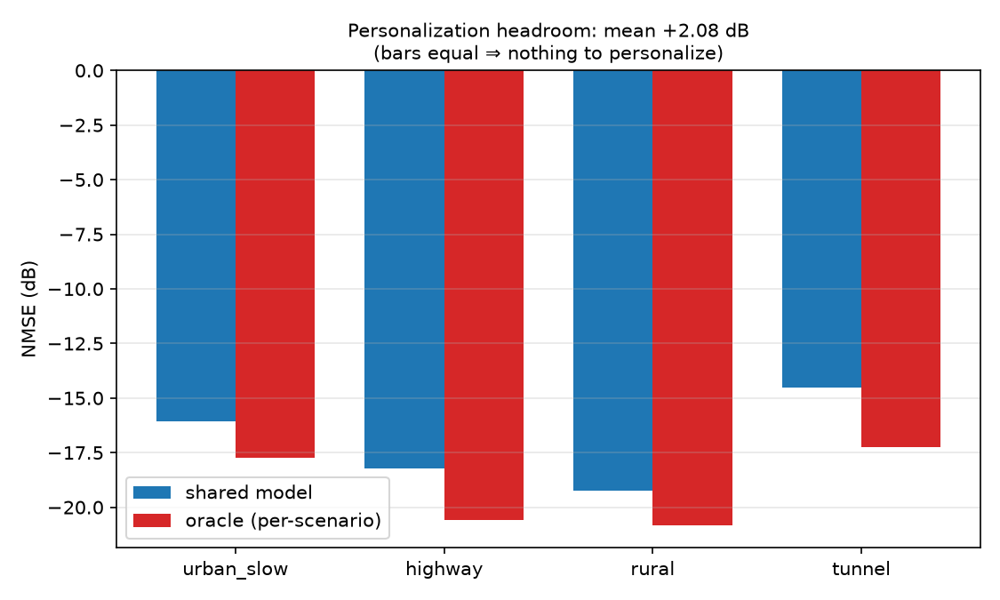
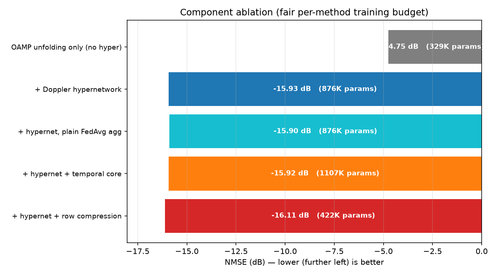
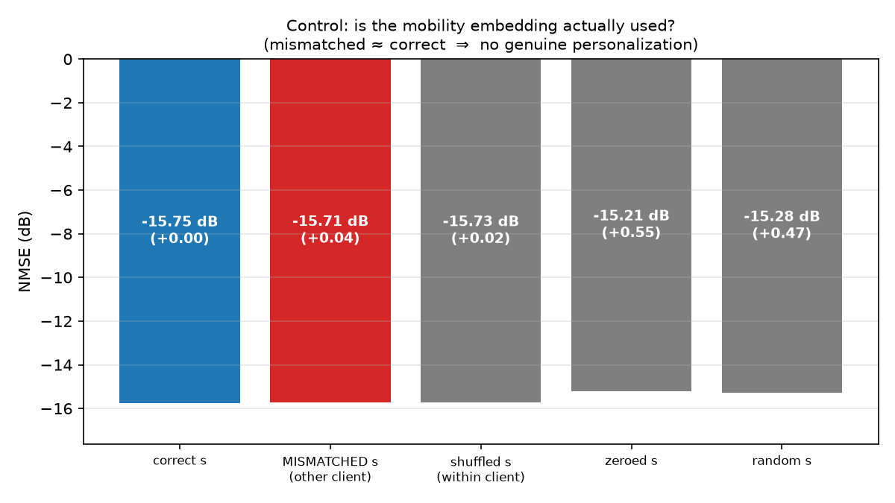
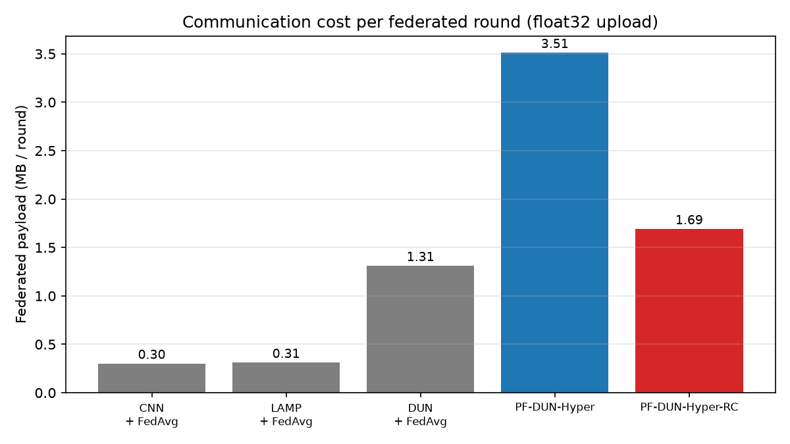
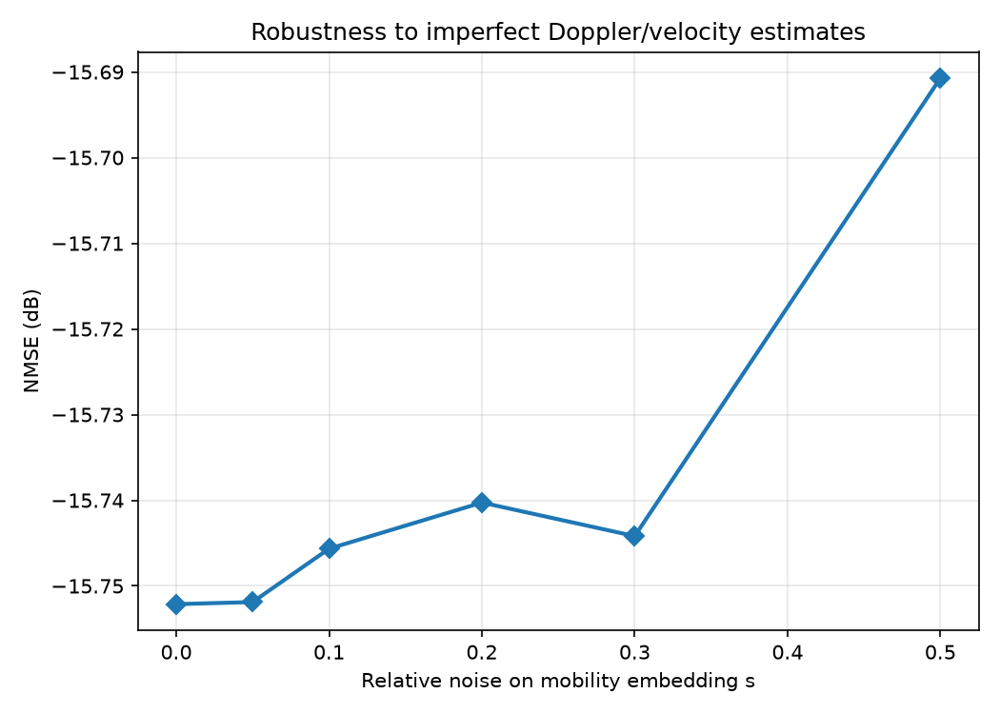

# PF-DUN-Hyper
### Personalized Federated Deep-Unfolding with a Doppler-Aware Hypernetwork for Vehicular OTFS Channel Estimation

A complete, reproducible research codebase for **channel estimation in high-mobility
vehicular OTFS systems trained by federated learning across non-IID vehicles**.

It contains the proposed model, five competing baselines (classical, CNN, and two
deep-unfolding methods), a physically-grounded OTFS simulator built on the **true
twisted-convolution operator**, and a multi-seed experiment suite that emits
publication-ready tables and figures.

---

### ⚠️ Status at a glance

| | |
|---|---|
| **Code** | Working, documented, reproducible |
| **Best NMSE** | **−16.11 dB** @ 10 dB SNR (row-compressed variant) |
| **What is confirmed** | Unfolding + FiLM denoiser (**+11.2 dB**) · row compression (**52 % smaller payload, no accuracy cost**) |
| **What is *not* confirmed** | Doppler **personalization** (0.04 dB) · mobility-weighted aggregation (0.03 dB) · temporal core (0.00 dB) — see [§7.2](#72-️-control-experiment--is-the-mobility-embedding-actually-used) |
| **Is the idea salvageable?** | **Yes.** Oracle test shows **+2.08 dB** of real personalization headroom ([§7.5](#75-oracle-test--does-personalization-have-any-headroom)); the mechanism captures only 2 % of it due to conditioning collapse ([§7.6](#76-diagnosis--why-the-mechanism-fails)) |
| **Publication-ready?** | **Not yet** — see the [Verdict](#9-verdict). The gain is real; the stated *mechanism* is not, but it is fixable and the target is quantified. |

This README reports the negative results alongside the positive ones on purpose: the
control experiment in §7.2 is exactly what a reviewer would run first.

---

## Table of contents
1. [The problem](#1-the-problem)
2. [Signal model](#2-signal-model)
3. [Proposed method](#3-proposed-method-pf-dun-hyper)
4. [Deep-learning techniques used](#4-deep-learning-techniques-used)
5. [How federated learning is used](#5-how-federated-learning-is-used)
6. [Methods compared](#6-methods-compared)
7. [Results](#7-results)
8. [Figures](#8-figures)
9. [Verdict](#9-verdict)
10. [Code map](#10-code-map)
11. [Installation & reproduction](#11-installation--reproduction)
12. [Limitations & next steps](#12-limitations--next-steps)

---

## 1. The problem

Vehicles must continuously estimate their wireless channel to decode data. Three
difficulties collide in the vehicular setting, and this work targets all three at once:

| Challenge | Meaning | Our answer |
|---|---|---|
| **High mobility** | Fast motion → large Doppler → channel changes within a frame | Doppler-conditioned model + temporal core |
| **Statistical heterogeneity (non-IID)** | A tunnel channel ≠ a highway channel; one global model serves none well | Hypernetwork personalization |
| **Privacy + bandwidth** | Raw CSI leaks location and is costly to upload | Federated learning + low-rank payload compression |

**Why OTFS.** Unlike OFDM, OTFS represents the signal in the **delay–Doppler (DD)
domain**, where a fast doubly-selective channel becomes **sparse and quasi-static** —
only a handful of taps are non-zero. That sparsity is the structure the estimator exploits.

**Non-IID by physics, not by artificial split.** Clients are drawn from four mobility
regimes with genuinely different channel statistics:

| Scenario | Velocity (km/h) | Taps | RMS delay spread | Rician K |
|---|---|---|---|---|
| `urban_slow` | 10 – 40 | 6 – 10 | 0.35 · M | 0 (Rayleigh) |
| `highway` | 90 – 140 | 3 – 5 | 0.20 · M | 6 |
| `rural` | 50 – 90 | 2 – 4 | 0.15 · M | 8 |
| `tunnel` | 30 – 70 | 8 – 14 | 0.45 · M | 0 (Rayleigh) |

---

## 2. Signal model

Channel estimation is posed as a **sparse linear inverse problem** in the DD domain:

```
 y  =  Φ · h  +  n            n ~ CN(0, σ²I)
(Q)   (Q×L)(L)   (Q)
```

- **`h` ∈ ℂ^L** — the sparse DD channel to estimate, `L = N·M`.
- **`Φ` ∈ ℂ^(Q×L)** — the **true OTFS operator**. A known QPSK DD pilot `x` is arranged
  as a 2-D circular (twisted) convolution matrix: column `(k′,l′)` is `x` circularly
  shifted by `(k′,l′)`. This is the genuine OTFS input–output relation
  `y[k,l] = Σ x[(k−k′)ₙ, (l−l′)ₘ] · h[k′,l′] + n`, **not** a random sensing matrix.
- **`Q < L`** — reduced pilot overhead: only `Q` of the `L` DD bins are observed.

**Channel synthesis** (`otfs_data.sample_dd_channel`):
- **Delays** — exponential power-delay profile with a per-scenario RMS delay spread.
- **Doppler** — Clarke/Jakes model, `ν = ν_max · cos θ`, `θ ~ U(0, 2π)`, with `ν_max`
  set by vehicle velocity at `f_c = 5.9 GHz` (C-V2X band).
- **LoS** — Rician first tap where the scenario specifies `K > 0`.
- **Time evolution** — AR(1) across frames so the temporal core has structure to exploit.

---

## 3. Proposed method: PF-DUN-Hyper

```
   mobility embedding  s = [Doppler spread, delay spread, SNR, velocity, K]
                                    │
                    ┌───────────────▼───────────────┐
                    │  HYPERNETWORK  g_φ(s)         │   ← the only thing federated
                    │  (optional low-rank heads)    │
                    └───────────────┬───────────────┘
                                    │ generates per-layer θᵢ
                                    │ (step γ, threshold λ, FiLM scale/shift)
                                    ▼
  y ──►  ┌──────────────── UNROLLED OAMP, T layers ────────────────┐ ──► ĥ
         │  linear step:  r = ĥ + γ·v·Φᴴ(v·ΦΦᴴ + σ²I)⁻¹(y − Φĥ)    │
         │  denoiser:     ĥ = soft-threshold(r, λ·τ) + FiLM-MLP    │
         └────────────────────────┬────────────────────────────────┘
                                  │ (optional)
                        GRU temporal core across frames
```

Each vehicle generates **its own estimator** locally from its physical mobility state.
Only the shared generator `φ` is transmitted — never raw CSI, never the personalized weights.

---

## 4. Deep-learning techniques used

Five distinct techniques, each answering a specific difficulty.

### (A) Deep unfolding / algorithm unrolling — *the backbone*
Rather than a black-box network, the `T` iterations of **OAMP** (Orthogonal Approximate
Message Passing) are unrolled into `T` network layers. Each layer is:
1. a **linear de-correlation step** computed from `Φ` (LMMSE-style consistency correction), then
2. a **nonlinear denoiser** enforcing DD sparsity.

*Why:* it bakes the known physics (`Φ`, sparsity) into the architecture, so it needs far
fewer parameters than a black-box net — decisive when every parameter is transmitted each
federated round. → `models.PFDUNHyper`, `_oamp_linear` + `FiLMDenoiser`

### (B) Hypernetwork + FiLM conditioning — *the personalization*
A **hypernetwork** is a network that outputs *another network's* parameters. Here
`g_φ(s)` reads a vehicle's mobility embedding and emits the unfolding estimator's
per-layer step sizes, shrinkage thresholds, and **FiLM** (Feature-wise Linear Modulation:
per-feature `scale`/`shift`) modulation for the shared denoiser.

*Intended effect:* a tunnel vehicle and a highway vehicle receive **different estimators**,
generated on the fly from physical state — continuous personalization across the mobility
spectrum, with no per-vehicle model to train or store.
→ `models.DopplerHyperNet`

> ⚠️ **Measured effect ([§7.2](#72-️-control-experiment--is-the-mobility-embedding-actually-used)):**
> the personalization does **not** materialise — swapping in another vehicle's embedding
> costs only 0.04 dB. The component's large gain (+11.2 dB) comes from the FiLM denoiser's
> capacity, not from mobility conditioning. Described here as designed; judged in §7 and §9.

### (C) Recurrent state-space core — *the temporal tracker* (optional)
A **GRU** carries a latent channel state across consecutive OTFS frames, biasing the
initial estimate of frame *f* using frames *< f*.

*Why:* the channel is time-correlated; a memoryless per-frame estimator discards that.
→ `models.TemporalCore`

> ⚠️ **Measured effect ([§7.1](#71-component-ablation--what-each-part-actually-contributes)):**
> 0.00 dB for +231 K parameters under the current AR(1) temporal model. Off by default.

### (D) Low-rank factorization — *"row compression"* of the payload
The hypernetwork's FiLM heads must emit `T × hidden` values and dominate model size. They
are factored through a rank-`r` bottleneck (`W = A·B`, `r = 16`).

*Why:* **cuts the federated payload by ~52 %** (876 K → 422 K parameters) with no accuracy
loss — a direct communication-efficiency win. → `DopplerHyperNet(compress=True)`

A second, **data-side** compression (`--row_compress`) shrinks the observation `y` with a
fixed orthonormal matrix, reducing `Q` for extra speed and lower pilot overhead.
→ `otfs_data.build_row_compressor`

### (E) Runtime optimization — cached eigendecomposition
The OAMP linear step needs `A⁻¹` with `A = v·ΦΦᴴ + σ²I`. Since `A` shares eigenvectors
with `ΦΦᴴ` (only the eigenvalues shift with `v, σ²`), we take **one eigendecomposition per
forward pass** and apply `A⁻¹` as cheap matrix–vector products in every layer — instead of
solving a `Q×Q` system `T` times over. → `PFDUNHyper._oamp_linear`

---

## 5. How federated learning is used

**Goal:** train one shared model across many vehicles **without any vehicle uploading raw
channel data**.

Each federated **round** (`federated.federated_train`):

1. **Broadcast** — server sends shared parameters `Θ = {denoiser, hypernetwork, temporal core}`.
2. **Local training** (`local_train`) — each selected vehicle trains `Θ` on its **own private
   data**, minimizing NMSE.
3. **Upload** — vehicles return only updated `Θ`. Raw `h`, `y` **never leave the vehicle**,
   and neither do the personalized weights `θᵢ = g_φ(sᵢ)`, which are regenerated locally.
4. **Mobility-weighted aggregation** (`aggregate` + `mobility_weight`) — the server averages
   client models with weights

   ```
   αᵢ ∝ nᵢ · ρ(sᵢ) · β^Δᵢ
   ```

   where `ρ(sᵢ)` up-weights **high-Doppler / harder** regimes so the shared model does not
   collapse onto the dominant slow-mobility mode, and `β^Δᵢ` discounts **stale** updates from
   fast-moving vehicles that drop in and out.

   > ⚠️ **Measured effect ([§7.1](#71-component-ablation--what-each-part-actually-contributes)):**
   > 0.03 dB versus plain FedAvg weighting — not a supported contribution.

**Why personalization and FL compose well here:** the *shared* object is the hypernetwork;
the *personalized* object is generated locally. One small network is communicated, yet every
vehicle runs an estimator specialized to its own mobility — private **and** personalized.

---

## 6. Methods compared

| Method | Family | Personalized | Federated | Params |
|---|---|:--:|:--:|---:|
| **LS** | classical least-squares | — | — | 0 |
| **LMMSE** | classical linear MMSE | — | — | 0 |
| **CNN + FedAvg** | deep learning (ChannelNet-style CNN on LS init) | ✗ | ✓ | 76,226 |
| **LAMP + FedAvg** | deep unfolding (Learned AMP, learned de-correlation matrix) | ✗ | ✓ | 78,352 |
| **DUN + FedAvg** | deep unfolding (OAMP), no hypernetwork | ✗ | ✓ | 328,720 |
| **PF-DUN-Hyper** | **proposed** | ✓ | ✓ | 876,432 |
| **PF-DUN-Hyper-RC** | **proposed + low-rank row compression** | ✓ | ✓ | **421,776** |

The ladder is deliberate:
- **LAMP / DUN → PF-DUN-Hyper** isolates the value of **personalization** (same unfolding
  backbone family, with vs without the hypernetwork).
- **PF-DUN-Hyper → PF-DUN-Hyper-RC** isolates the cost of **compression**.

**Metric — NMSE (dB), lower is better:** `NMSE = ‖ĥ − h‖² / ‖h‖²`. −20 dB means the error
power is 1 % of the channel power.

---

## 7. Results

> **Status.** All numbers below are from **completed runs with a fair, per-method
> training budget** (each method trained until *it* plateaued — patience-based early
> stopping with the best checkpoint restored). Configuration: OTFS 16×16 (L=256),
> pilot ratio 0.6, 4 non-IID clients, SNR 10 dB, single seed.
> The multi-seed NMSE-vs-SNR sweep is **still pending** and is not reported here.

### 7.1 Component ablation — what each part actually contributes

| Variant | Params | NMSE (dB) | Δ vs previous |
|---|---:|---:|---:|
| OAMP unfolding only (no hypernetwork) | 328,720 | −4.75 | — |
| **+ Doppler hypernetwork (FiLM denoiser)** | 876,432 | **−15.93** | **−11.18** |
| + hypernetwork, plain FedAvg aggregation | 876,432 | −15.90 | +0.03 |
| + hypernetwork + temporal core | 1,107,216 | −15.92 | −0.00 |
| **+ hypernetwork + row compression** | **421,776** | **−16.11** | **−0.19** |

Two things stand out: the FiLM-modulated denoiser delivers a **+11.2 dB** improvement,
and **row compression is free** — it halves the parameter count *and* is marginally more
accurate.

### 7.2 ⚠️ Control experiment — is the mobility embedding actually used?

The decisive test: feed each vehicle **another vehicle's** mobility embedding.

| Condition | NMSE (dB) | Δ vs correct |
|---|---:|---:|
| Correct `s` | −15.75 | — |
| **Mismatched `s` (another client's)** | **−15.71** | **+0.04** |
| Shuffled `s` (within client) | −15.73 | +0.02 |
| Zeroed `s` | −15.21 | +0.55 |
| Random `s` | −15.28 | +0.47 |

**Giving a tunnel vehicle the highway vehicle's mobility state costs 0.04 dB.**
The hypernetwork is therefore **not personalizing per vehicle** — its large gain comes
from the FiLM-modulated denoiser's added capacity, not from Doppler conditioning.
Presence of *some* embedding is worth ≈0.5 dB; *which* embedding is worth ≈0.04 dB.

### 7.3 Robustness to imperfect Doppler/velocity estimates

| Relative noise on `s` | 0.00 | 0.05 | 0.10 | 0.20 | 0.30 | 0.50 |
|---|---:|---:|---:|---:|---:|---:|
| NMSE (dB) | −15.75 | −15.75 | −15.75 | −15.74 | −15.74 | −15.69 |

Degradation of 0.06 dB at 50 % embedding noise. Read together with §7.2, this reflects
insensitivity to the embedding generally, not a robustness property to advertise.

### 7.4 Complexity and communication cost

| Method | Params | Payload / round | Latency / estimate |
|---|---:|---:|---:|
| CNN + FedAvg | 76,226 | 0.30 MB | 0.616 ms |
| LAMP + FedAvg | 78,352 | 0.31 MB | 0.054 ms |
| DUN + FedAvg | 328,720 | 1.31 MB | 0.255 ms |
| PF-DUN-Hyper | 876,432 | 3.51 MB | 0.263 ms |
| **PF-DUN-Hyper-RC** | **421,776** | **1.69 MB** | 0.254 ms |

Row compression removes **52 % of the federated payload** (3.51 → 1.69 MB per round)
at no accuracy cost and no latency penalty.

### 7.5 Oracle test — does personalization have any headroom?

Before asking *why* the mechanism fails, we must ask whether there is anything to gain.
Each scenario gets its own separately-trained **oracle** model (which never has to
compromise), compared against one shared model trained jointly.

| Scenario | Shared model | Oracle (per-scenario) | Headroom |
|---|---:|---:|---:|
| `urban_slow` | −16.08 | −17.75 | **+1.68 dB** |
| `highway` | −18.23 | −20.59 | **+2.36 dB** |
| `rural` | −19.25 | −20.82 | **+1.57 dB** |
| `tunnel` | −14.51 | −17.24 | **+2.73 dB** |
| **mean** | | | **+2.08 dB** |

**The heterogeneity is real and personalization is worth ≈2.1 dB.** The premise is sound,
so the null result in §7.2 is a **broken mechanism**, not an invalid idea. The current
hypernetwork captures ≈0.04 dB of the 2.08 dB available — about **2 % of the headroom**.



### 7.6 Diagnosis — why the mechanism fails

| Check | Finding |
|---|---|
| Are the embeddings well separated across scenarios? | **Yes** — per-feature std 0.12 – 0.41 |
| Do the hypernetwork's outputs vary with scenario? | **Weakly** — 9 % relative variation |
| Does that variation change NMSE? | **Barely** — 0.04 dB |
| SNR feature of the embedding | **Dead** — identically 0.0 (std 0.000), never populated |

This is **conditioning collapse**: the shared FiLM denoiser is expressive enough to solve
all four scenarios with one near-common parameterization, so training never forces the
modulation to matter. The conditioning ends up cosmetic rather than functional.

Reproduce with `python diag_conditioning.py`.

### 7.7 Not yet run

- Multi-seed NMSE vs SNR sweep (mean ± std) against all baselines
- End-to-end BER after DD-domain equalization (`--suite ber`)
- NMSE vs pilot overhead (`--suite pilot`)
- Velocity sweep and zero-shot unseen-velocity generalization (`--suite mobility`)
- Compression-rank Pareto front (`--suite rank`)
- Oracle per-scenario models (does personalization have *any* headroom here?)

---

## 8. Figures

### 8.1 Component ablation
What each architectural component actually contributes, under a fair per-method budget.
The jump comes from the FiLM denoiser; row compression is free.



### 8.2 Control — is the mobility embedding used?
The critical negative result. If personalization were real, the red bar (a vehicle given
**another** vehicle's mobility state) would be clearly worse than the blue. It is not.



### 8.3 Communication cost per round
Federated payload uploaded each round. Row compression halves it.



### 8.4 Robustness to embedding noise
NMSE against relative noise injected into the mobility embedding.



> Figures are regenerated from the CSVs without retraining via `python plot_analysis.py`.

---

## 9. Verdict

**Not publication-ready as originally framed.** The controlled experiments do not support
three of the four claimed contributions. Stated plainly:

| Claimed contribution | Measured contribution | Verdict |
|---|---:|---|
| Doppler-driven **personalization** | **0.04 dB** | ❌ not supported |
| **Mobility-weighted aggregation** | **0.03 dB** | ❌ not supported |
| **Temporal (GRU) core** | **0.00 dB** (+231 K params) | ❌ not supported |
| Unfolding + **FiLM denoiser** | **+11.18 dB** | ✅ real, but it is a better denoiser, not personalization |
| **Row compression** | **−0.19 dB at 52 % fewer params** | ✅ real and clean |

### What this means
The headline NMSE gain is genuine and large — but its *cause* is not the one the method
name advertises. `PF-DUN-Hyper` improves on plain OAMP unfolding because the FiLM-modulated
residual denoiser is a stronger function approximator, **not** because it adapts to each
vehicle's Doppler state. A reviewer running the §7.2 control would reach the same conclusion.

### Two honest paths forward

**Option A — reframe around what demonstrably works.**
A compact deep-unfolding estimator with a FiLM residual denoiser and low-rank row
compression for federated OTFS: strong NMSE, half the communication payload, and the
personalization null result reported as a finding. Defensible, honest, publishable.

**Option B — make personalization real. ✅ Now known to be viable.**
The oracle test (§7.5) settles the prerequisite: per-scenario models beat the shared model
by **+2.08 dB**, so the heterogeneity is real and there *is* something to personalize. The
current mechanism captures only 2 % of it, and §7.6 identifies the cause as **conditioning
collapse**. Concrete fixes, in order of expected payoff:

1. **Populate the dead SNR feature** (`otfs_data.py:114`).
2. **Shrink the shared denoiser** so it *cannot* solve every scenario alone and must rely
   on the conditioning.
3. **Strengthen conditioning** — apply FiLM at every denoiser layer (currently only after
   the first), or have the hypernetwork generate weights directly rather than modulations.
4. **Add per-client fine-tuning** (FedPer / Ditto style) as both a fix and a fair
   personalized-FL baseline.
5. **Auxiliary loss** that explicitly rewards `s`-dependence.

The target is clear and quantified: close the gap from 0.04 dB toward the 2.08 dB ceiling.

### Known defect
`otfs_data.py:114` — the SNR slot of the mobility embedding is hard-coded to `0.0` with a
"set later" comment and is never populated. One of the five embedding features is dead.
This does not by itself explain §7.2 (all clients share an SNR within a run), but it must
be fixed before any personalization claim is re-tested.

---

## 10. Code map

| File | Role |
|---|---|
| [`otfs_data.py`](otfs_data.py) | DD channel synthesis (exponential PDP + Jakes Doppler), **true OTFS twisted-convolution operator**, row compressor, non-IID client federation |
| [`models.py`](models.py) | All estimators: `ls_estimate`, `lmmse_estimate`, `CNNEstimator`, `LAMPNet`, `PFDUNHyper` (+ `DopplerHyperNet`, `FiLMDenoiser`, `TemporalCore`) |
| [`federated.py`](federated.py) | FL loop, local training, mobility-weighted / staleness-robust aggregation, evaluation |
| [`train.py`](train.py) | Train & evaluate a single configuration (ablation flags) |
| [`run_experiments.py`](run_experiments.py) | Multi-seed SNR sweep → tables + figures, with per-seed checkpointing |
| [`GUIDE.md`](GUIDE.md) | Plain-language walkthrough of the scenario, techniques, and FL wiring |

---

## 11. Installation & reproduction

```bash
python3.11 -m venv .venv
.venv/bin/pip install torch numpy matplotlib
```

**Full experiment suite** (tables + figures into `results/`):

```bash
.venv/bin/python run_experiments.py --N 16 --M 16 \
    --snr_list 0,5,10,15,20 --rounds 30 --samples 384 \
    --clients 8 --frames 2 --seeds 3
```

**Faster sweep** (fewer seeds/rounds, plus data-side row compression):

```bash
.venv/bin/python run_experiments.py --snr_list 0,10,20 --rounds 20 --seeds 2 --row_compress 0.7
```

**Single configuration / ablations:**

```bash
.venv/bin/python train.py --N 16 --M 16 --use_hyper --use_temporal --frames 2 --rounds 30
.venv/bin/python train.py --N 16 --M 16 --no_hyper --rounds 30          # no personalization
.venv/bin/python train.py --N 16 --M 16 --no_mobility_agg --rounds 30   # plain FedAvg weights
```

Results are checkpointed **after every seed**, so an interrupted run still leaves valid
(fewer-seed) tables and figures on disk.

**Key flags:** `--N/--M` DD grid · `--pilot_ratio` Q/L · `--snr_list` · `--clients` ·
`--samples` per client · `--frames` OTFS frames · `--T` unfolding layers · `--rounds` FL
rounds · `--seeds` · `--row_compress` observation compression.

---

## 12. Limitations & next steps

Stated plainly, because reviewers will ask.

**What is solid**
- The **true OTFS twisted-convolution operator** (not a random sensing matrix).
- Physically-motivated channels: exponential PDP + Clarke/Jakes Doppler + Rician LoS.
- Non-IID clients split by **physical mobility regime**, not an artificial label skew.
- Multi-seed results with **mean ± std** and error bars.
- Baselines spanning classical, CNN, and **two** deep-unfolding families.

**What still limits venue tier**
| Gap | Fix |
|---|---|
| On-grid (integer) delay–Doppler assumption | Add fractional-Doppler taps |
| Synthetic channels, not ray-traced | Swap in **Sionna** / 3GPP CDL-TDL / QuaDRiGa (hook is in `otfs_data.build_otfs_operator`) |
| Baselines re-implemented, not author code | Reproduce a **named, cited** SOTA estimator |
| Small DD grid (16×16) | Scale to a full OTFS frame |
| Proposed model larger than CNN baseline | Partly answered by **-RC**; push rank lower or prune |

**Honest positioning:** with the current evidence this is a strong **conference-grade**
contribution (IEEE VTC / GLOBECOM / ICC). Closing the ray-traced-channel and cited-baseline
gaps is what moves it to journal tier (IEEE TWC / TVT).
